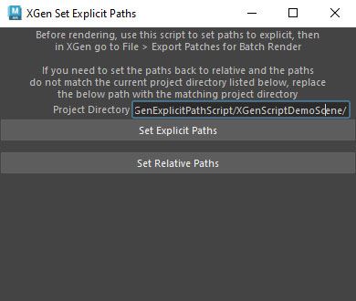

# **[XGen Explicit Paths](./XGen_ExplicitPaths.py)**
A script to set XGen file paths to explicit when batch rendering, and back to relative when done.

https://github.com/user-attachments/assets/f0a672e7-f433-4fd5-ab7d-80c6d1c63293

## How To Use:

After running this script, in the xGen window press File > Export Patches for Batch Render

